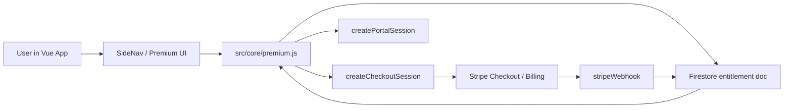
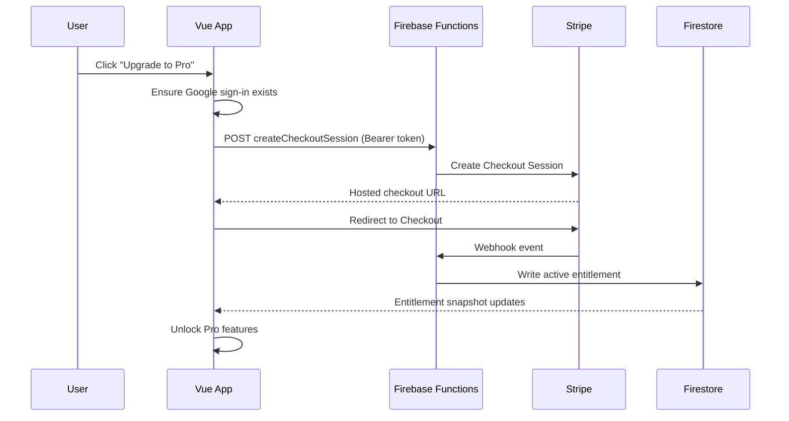
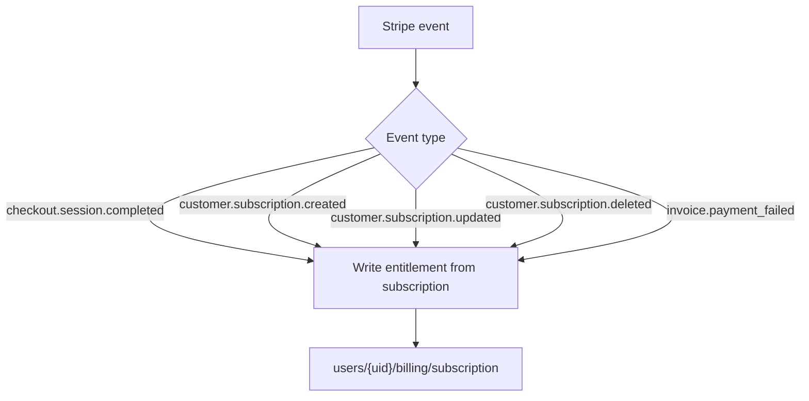
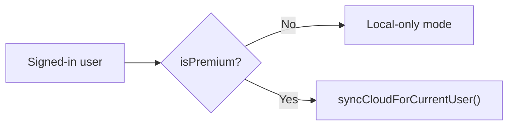

# Stripe Premium Architecture

This document explains how MNEMONIC's Pro subscription system works across the frontend, Firebase Functions, Firestore, and Stripe.

## Goals

- Keep core mnemonic training free.
- Unlock cloud sync and advanced analytics for Pro subscribers.
- Make billing state server-owned and easy to reason about.
- Support developer/admin overrides without mixing them into normal user sync data.

## What Pro Unlocks

| Area | Free | Pro |
| --- | --- | --- |
| Deck browsing, quiz mode, speed drills, editor, preview | Yes | Yes |
| Local stats and local persistence | Yes | Yes |
| Google sign-in for identity | Yes | Yes |
| Cloud sync across devices | No | Yes |
| Advanced dashboard analytics | No | Yes |
| Training heatmap, mastery rollups, session history | No | Yes |
| `PriorityCoach` and `FantasyQuestPanel` | No | Yes |

## High-Level System Map

## Main Runtime Flow

### 1. Entitlement loading

- The client subscribes to `users/{uid}/billing/subscription`.
- `src/core/premium-state.js` normalizes the Firestore payload into a stable entitlement snapshot.
- That snapshot drives:
  - whether the account is premium
  - whether cloud sync is allowed
  - whether premium UI should render or show teaser cards

### 2. Upgrade flow

### 3. Billing management flow

- A premium user clicks `Manage billing`.
- The client calls `createPortalSession`.
- Firebase Functions creates a Stripe Customer Portal session.
- Stripe returns a hosted portal URL.
- The user manages payment method or cancellation in Stripe.
- Stripe webhook events update Firestore entitlement state.

## Firestore Data Model

Path:

`users/{uid}/billing/subscription`

Shape:

| Field | Type | Notes |
| --- | --- | --- |
| `status` | string | `inactive`, `trialing`, `active`, `past_due`, `canceled`, `unpaid` |
| `isPremium` | boolean | Derived server-side/client-normalized |
| `stripeCustomerId` | string | Stripe customer id |
| `stripeSubscriptionId` | string | Stripe subscription id |
| `priceId` | string | Active Stripe price id |
| `currentPeriodEnd` | number | Unix ms in app-facing state |
| `cancelAtPeriodEnd` | boolean | Stripe cancellation flag |
| `updatedAt` | number | Last write timestamp |
| `manualGrant` | boolean | Present for admin-issued Pro grants |
| `grantedBy` | string | Admin email or uid for manual grants |
| `targetEmail` | string | Helpful lookup for manual grants |

Important boundary:

- Billing state lives only in this subscription doc.
- Generic sync docs under `/users/{uid}/data/*` are not used for billing.

## Function Endpoints

Source:

- `functions/src/index.js`

### `createCheckoutSession`

Purpose:

- Authenticated endpoint that creates a Stripe Checkout Session in subscription mode.

Inputs:

- Firebase ID token in `Authorization: Bearer ...`
- optional `returnUrl`

Output:

- Stripe Checkout URL
- session id

Behavior:

- creates or reuses a Stripe customer
- rejects checkout if the user is already premium
- attaches `firebaseUID` metadata to both checkout and subscription records

### `createPortalSession`

Purpose:

- Opens Stripe Customer Portal for an existing Stripe customer.

Behavior:

- requires auth
- requires an existing `stripeCustomerId`
- returns a hosted portal URL

### `stripeWebhook`

Purpose:

- Applies Stripe subscription lifecycle changes back into Firestore.

Handled events:

- `checkout.session.completed`
- `customer.subscription.created`
- `customer.subscription.updated`
- `customer.subscription.deleted`
- `invoice.payment_failed`

Webhook lifecycle:

### `grantPremiumAccess`

Purpose:

- Admin-only helper for manually granting Pro by email or Firebase UID.

Behavior:

- requires a valid Firebase ID token
- allows only emails listed in `ADMIN_EMAILS`
- writes a Pro entitlement with `manualGrant: true`

## Client Modules

### `src/core/premium-state.js`

Owns the pure state rules:

- whether a subscription counts as premium
- which features are available
- plan labels and upgrade labels
- developer/admin overrides
- billing return-state parsing

This file is the best place to change entitlement rules without touching UI.

### `src/core/premium.js`

Owns the live runtime integration:

- subscribes to Firebase auth state
- subscribes to Firestore entitlement state
- calls checkout / portal / admin grant functions
- exposes helper methods used by Vue components

### `src/components/SideNav.vue`

Owns the account-facing premium controls:

- plan badge
- upgrade CTA
- manage billing button
- admin-only manual Pro grant form

### Premium-gated views

| File | Premium behavior |
| --- | --- |
| `src/views/Home.vue` | Locks `PriorityCoach` and `FantasyQuestPanel` behind Pro |
| `src/views/Dashboard.vue` | Locks deeper analytics and presents upgrade teasers |
| `src/views/TrainingLogPremium.vue` | Adds premium training log surfaces |

## Sync Behavior

Cloud sync now depends on premium entitlement rather than sign-in alone.

This means:

- free signed-in users keep local-only data
- premium signed-in users sync across devices

## Environment Variables

### Frontend

| Variable | Purpose |
| --- | --- |
| `VITE_PREMIUM_API_BASE` | Base URL for deployed premium functions |
| `VITE_STRIPE_PUBLISHABLE_KEY` | Stripe publishable key used by the client |
| `VITE_DEV_PREMIUM_EMAILS` | Comma-separated emails that always get Pro locally |
| `VITE_ADMIN_EMAILS` | Comma-separated emails that can use the admin UI |

### Functions

| Variable | Purpose |
| --- | --- |
| `STRIPE_SECRET_KEY` | Stripe secret key for API calls |
| `STRIPE_WEBHOOK_SECRET` | Stripe webhook signing secret |
| `STRIPE_PRO_MONTHLY_PRICE_ID` | Stripe monthly Pro price id |
| `APP_BASE_URL` | App URL for Stripe return routes |
| `VITE_STRIPE_PUBLISHABLE_KEY` | Echoed in checkout response when needed |
| `ADMIN_EMAILS` | Comma-separated admin emails for manual grants |

## Security Model

### Protected by the backend

- Stripe secret key usage
- Stripe webhook validation
- Stripe customer and subscription writes
- manual Pro grants

### Read-only on the client

- users can read their own entitlement summary
- users cannot write their own billing state from the client

### Local-only overrides

- developer premium override is environment-based on the frontend
- this is convenient for development, but should stay controlled outside public builds

## Operational Notes

- The Stripe webhook endpoint must point to the deployed `stripeWebhook` function.
- `APP_BASE_URL` should match the environment users return to after checkout or portal actions.
- If keys are ever shared in chat, logs, or screenshots, rotate them in Stripe.
- Functions deploy can succeed even when Firebase prints a cleanup-policy warning afterward; verify deployed functions directly when in doubt.

## Recommended Merge Checklist

| Step | Why it matters |
| --- | --- |
| Confirm `.env` and `functions/.env` stay untracked | Prevents leaking secrets |
| Rotate exposed Stripe test or live keys | Removes compromised credentials |
| Verify Stripe webhook endpoint and subscribed events | Keeps entitlement sync correct |
| Set `APP_BASE_URL` to the real frontend URL | Prevents redirecting users to localhost |
| Test one full checkout in test mode | Confirms end-to-end billing |
| Test one admin manual grant | Confirms support tooling works |

